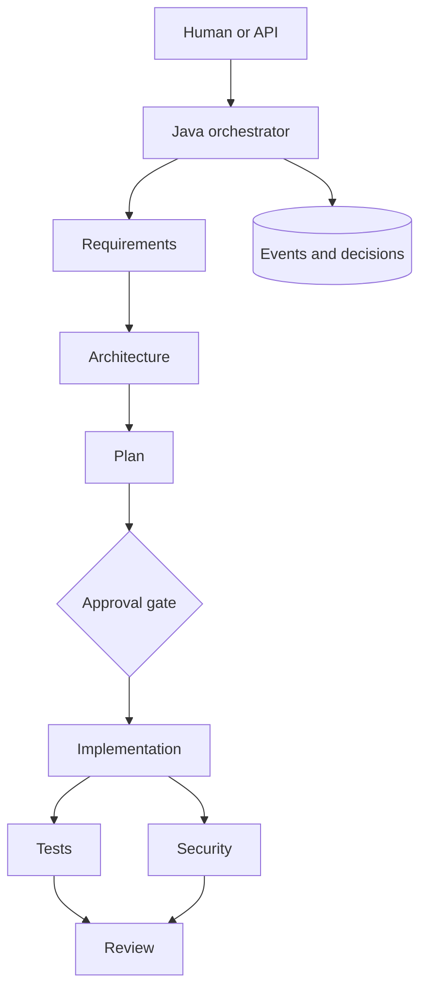

# Agentic URL Shortener — Java 21

A reviewable prototype of a governed, agentic SDLC system and the URL-shortener product it manages.
The Java orchestration engine owns the graph, state, policy, retries, approvals, audit trail, and release
gate. AI agents receive bounded contexts and return strict structured outputs.

## Assessment evidence

| Requested evidence | Where to review it |
| --- | --- |
| Working solution | [Run instructions](#run-locally), workflow API, URL-shortener API, Docker Compose, and integration tests under `src/test` |
| Technical decisions and trade-offs | [Architecture](docs/ARCHITECTURE.md) and [decision log](docs/DECISIONS.md) |
| Testing approach | [Testing strategy and coverage matrix](docs/TESTING.md) plus the Java 21 GitHub Actions workflow |
| AI-assisted development practices | [AI-assisted development record](docs/AI_ASSISTED_DEVELOPMENT.md) |

The repository is intentionally reviewable without an OpenAI key: deterministic agents exercise the full
workflow locally, while AI mode is an explicit configuration switch.

## What is implemented

- Java 21 and Spring Boot 3
- Persistent seven-stage workflow DAG
- Parallel test and security branches with review synchronization
- High-risk human approval and rejection endpoints
- Bounded retry and safe-stop behavior
- SHA-256 artifact hashes in workflow events and separate decision lineage
- Success, retry, rollback, approval, latency, and MTTR metrics
- Typed Requirement, Architecture, Planner, Implementation, Test, Security, and Reviewer agents
- OpenAI Responses API integration with strict JSON Schema outputs
- Deterministic demo agents when AI is disabled
- Controlled file upserts and fixed-command Maven test tool
- URL creation, redirect, expiration, analytics, and soft deletion
- H2 for local development and PostgreSQL configuration for containers
- Integration tests for the workflow and shortener APIs

## Architecture



The model can propose or perform bounded work. It cannot change retry budgets, bypass dependencies,
approve high-impact tasks, execute arbitrary shell text, or write outside the managed workspace.

## Run locally

Requirements: JDK 21 and Maven 3.9 or newer.

```bash
mvn clean test
mvn spring-boot:run
```

- `mvn` starts Maven.
- `clean` removes the previous `target` build directory so stale bytecode cannot affect validation.
- `test` compiles production and test code, then runs the JUnit suite.
- `spring-boot:run` compiles and starts the application with Spring Boot's Maven plugin.

The default profile uses an in-memory H2 database and deterministic agents, so it requires no API key.

## Run with Docker and PostgreSQL

```bash
docker compose up --build
```

- `docker compose` reads `compose.yml` and coordinates the database and application containers.
- `up` creates and starts those services.
- `--build` rebuilds the Java image before startup so the container contains current source code.

## Enable the AI agents

```bash
export OPENAI_API_KEY="your-key"
export AGENTIC_AI_ENABLED=true
mvn spring-boot:run
```

- `export` adds a variable to processes launched from the current shell.
- `OPENAI_API_KEY` is sent only in the API authorization header; do not commit it.
- `AGENTIC_AI_ENABLED=true` switches the typed agents from deterministic demo output to OpenAI.
- `OPENAI_MODEL` can override the configured model without changing source.

The integration uses `POST /v1/responses` and places each agent's JSON Schema under `text.format` with
strict validation.

## Workflow API

| Method | Endpoint | Purpose |
| --- | --- | --- |
| `POST` | `/api/workflows` | Create the fixed governed DAG from a requirement |
| `POST` | `/api/workflows/{id}/execute` | Run all currently eligible tasks |
| `GET` | `/api/workflows/{id}` | Read workflow and task state |
| `POST` | `/api/workflows/{id}/tasks/{taskKey}/approve` | Approve and resume a gated task |
| `POST` | `/api/workflows/{id}/tasks/{taskKey}/reject` | Reject a gated task and stop the workflow |
| `GET` | `/api/workflows/{id}/events` | Read the ordered audit trail |
| `GET` | `/api/workflows/{id}/decisions` | Read decision lineage |
| `GET` | `/api/workflows/{id}/metrics` | Read reliability metrics |

Create a workflow:

```bash
curl -s -X POST http://localhost:8080/api/workflows \
  -H 'Content-Type: application/json' \
  -d '{"requirement":"Add optional URL expiration"}'
```

- `curl` sends the HTTP request.
- `-s` hides curl's progress meter while retaining the response body.
- `-X POST` selects the HTTP `POST` method.
- `-H` adds the JSON content-type header.
- `-d` supplies the request body.

Execute it, using the returned UUID:

```bash
curl -s -X POST http://localhost:8080/api/workflows/WORKFLOW_ID/execute
```

Execution pauses at `implementation` because its risk is `HIGH`. Approve and resume:

```bash
curl -s -X POST \
  http://localhost:8080/api/workflows/WORKFLOW_ID/tasks/implementation/approve
```

## URL-shortener API

| Method | Endpoint | Purpose |
| --- | --- | --- |
| `POST` | `/api/urls` | Create a secure eight-character code |
| `GET` | `/r/{code}` | Record a click and return HTTP 302 |
| `GET` | `/api/urls/{code}` | Read URL metadata |
| `GET` | `/api/urls/{code}/analytics` | Read click analytics |
| `DELETE` | `/api/urls/{code}` | Soft-delete the short URL |

Only `http` and `https` destinations are accepted. Expired URLs return HTTP `410 Gone`; unknown or
inactive URLs return HTTP `404 Not Found`.

## Package boundaries

```text
agent/          typed agent prompts, outputs, schemas, and OpenAI client
api/            workflow REST resources and metrics queries
orchestrator/   DAG execution, policies, retries, audit, and decisions
shortener/      URL-shortener product API and persistence
tools/          bounded workspace and build capabilities
workflow/       persistent workflow, task, event, and decision models
```

## Important safety behavior

- The implementation agent can only request `UPSERT`; deletion is rejected.
- Every file path is normalized and must remain under `managed-workspace/url-shortener`.
- Tests use the exact argument list `./mvnw test --batch-mode --no-transfer-progress`; model text never
  enters a shell.
- `--batch-mode` disables Maven's interactive prompts.
- `--no-transfer-progress` hides dependency-download progress while preserving errors and test output.
- Test commands time out after two minutes and are forcibly terminated.
- Inputs and outputs are SHA-256 hashed in workflow events for artifact correlation and change detection.
- Full artifacts remain attached to tasks; audit events store summaries and hashes.

## Documentation index

- [Architecture and limitations](docs/ARCHITECTURE.md)
- [Technical decision log](docs/DECISIONS.md)
- [Testing strategy](docs/TESTING.md)
- [AI-assisted development practices](docs/AI_ASSISTED_DEVELOPMENT.md)
- [Interview demonstration](docs/DEMO.md)
