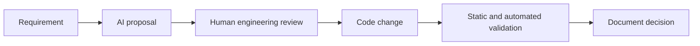

# AI-assisted development practices

This document describes how AI assisted the development of this assessment. It is separate from the runtime
agent architecture: one concerns how the project was built, while the other is functionality inside the
project.

## How AI was used

AI assistance was used for:

- Translating the assignment into explicit engineering acceptance criteria.
- Decomposing the lifecycle into requirements, architecture, planning, implementation, testing, security,
  and review stages.
- Comparing orchestration approaches and selecting a Java-owned DAG rather than LLM-owned control flow.
- Drafting Java entities, REST resources, structured agent outputs, migrations, and integration-test cases.
- Reviewing concurrency, persistence, timeout, path-containment, and command-execution risks.
- Producing architecture, decision, testing, and demonstration documentation.

## Development workflow

AI output was treated as a proposal, not as authority. Architecture and governance choices remained human
decisions, and generated code was reviewed for failure behavior and security boundaries before inclusion.

## Examples of AI suggestions that were changed during review

| Initial direction | Engineering correction | Reason |
| --- | --- | --- |
| Save detached JPA entities repeatedly | Reassign the entity returned by `save` and remap tasks by stable key | Avoid stale optimistic-lock versions after `EntityManager.merge` |
| Use `CompletableFuture.orTimeout` | Use cancellable `Future.get` deadlines plus HTTP read timeouts | `orTimeout` does not necessarily stop the underlying side effect |
| Allow clients to disable approval | Make approval mandatory for `HIGH` and `CRITICAL` risk | A request parameter must not bypass governance policy |
| Check normalized path prefix only | Also reject symbolic-link components | Normalization alone does not address symlink-based escapes |
| Describe artifact hashes as tamper-evident | Describe them as correlation and change-detection hashes | Independent hashes are not a cryptographic event chain |
| Let tests review code conceptually | Add a bounded build tool using a fixed Maven argument list | Test claims should rely on executable evidence when available |

These corrections demonstrate the expected pattern: generate quickly, review skeptically, and retain only
changes that satisfy explicit invariants.

## Validation applied to AI-generated work

- Inputs and outputs use typed Java records and strict JSON Schemas.
- Untrusted requirements are labeled as data in agent prompts.
- The model cannot change dependencies, retry limits, or approval status.
- File operations are path-contained and limited to upsert.
- Shell text from the model is never executed.
- Deterministic agents make the orchestration testable without model variability.
- JUnit integration tests verify externally observable workflow and product behavior.
- Documentation explicitly lists known prototype limitations instead of presenting them as completed work.

## Reproducibility and disclosure

The repository includes the prompts embedded in each agent class, its structured output schemas, deterministic
fallbacks, and the decision log. A reviewer can therefore see where AI is used, what context it receives, and
which controls remain outside the model.

No API key, conversation transcript, proprietary code, or private data is committed. The commit history should
preserve meaningful milestones rather than hiding AI-assisted changes in one opaque generated commit.

## Suggested commit narrative

Use small commits that make the development lineage easy to review:

1. `chore: bootstrap Java 21 Spring Boot project`
2. `feat: add persisted workflow DAG and scheduler`
3. `feat: add approval retry and safe-stop governance`
4. `feat: add audit events decisions and metrics`
5. `feat: add typed AI agents and bounded tools`
6. `feat: implement URL shortener and analytics`
7. `test: add workflow security and API integration tests`
8. `docs: document architecture trade-offs and AI-assisted development`
