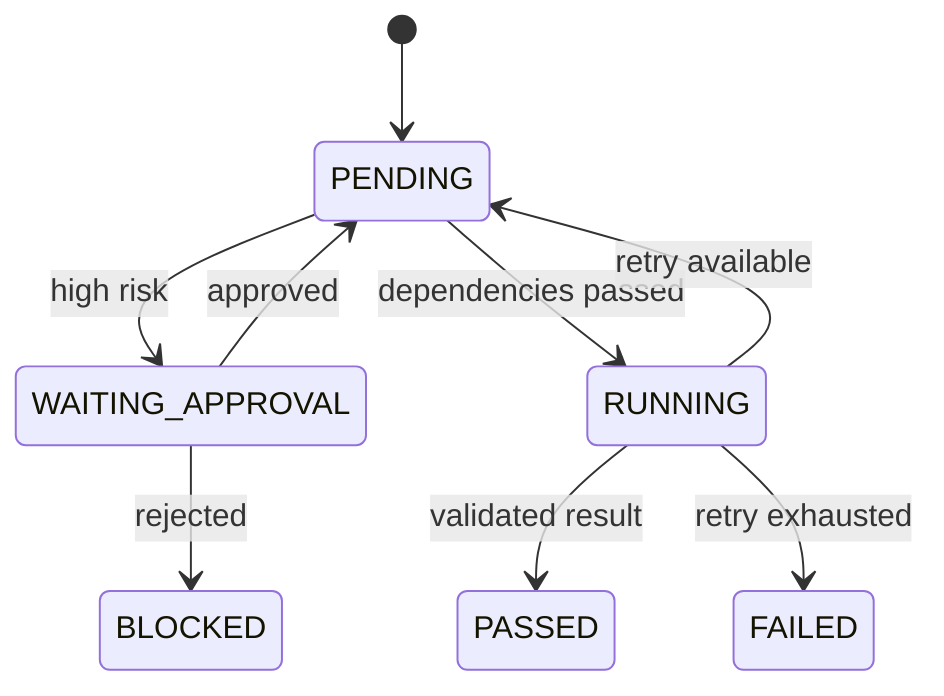

# Architecture and engineering decisions

## Control plane versus agent plane

The orchestrator is deterministic Java code. It decides when work is eligible, which tasks may run in
parallel, when execution pauses, and when failure becomes a retry or safe stop. Agents only transform a
bounded `AgentContext` into an `AgentExecutionResult`.

This keeps controlled autonomy enforceable even if a model returns incorrect or hostile content.

## State transitions

An empty ready set is not automatically success. The engine checks, in order, for all tasks passed,
pending human approval, and then an unrecoverable graph state that requires safe stop.

## Parallelism and synchronization

Every scheduler iteration creates immutable agent contexts, marks the selected tasks running, and submits
them to a bounded fixed thread pool. Results are collected before state mutations are persisted. The test
and security tasks both depend on implementation; review depends on both, creating an explicit join.

## Audit and lineage

`workflow_events` records transitions, timestamps, attempts, duration, SHA-256 input/output hashes, and
safe summary details. The hashes correlate stored artifacts and reveal accidental content changes; they are
not a cryptographic event chain. `decision_records` stores the decision, rationale, source agent, task,
workflow, and timestamp. This separates operational trace data from engineering rationale.

## AI boundary

The same typed agents work in two modes:

- Demo mode returns stable Java objects for offline tests and interview demonstrations.
- AI mode sends system/user messages to the Responses API and requires a strict JSON Schema output.

The provider client is behind `StructuredAiClient`, so it can be replaced without changing governance.

## Known prototype limits

- Workflow execution is synchronous at the REST boundary; production should dispatch it to a durable queue.
- A production deployment should add authentication, per-tenant authorization, and rate limiting.
- Git checkpoint/rollback events are modeled but a repository-specific Git adapter is not yet connected.
- Dynamic plan rewriting should validate cycles and preserve artifact revision lineage before activation.
- URL analytics are intentionally basic and do not retain IP address or user-agent data.
